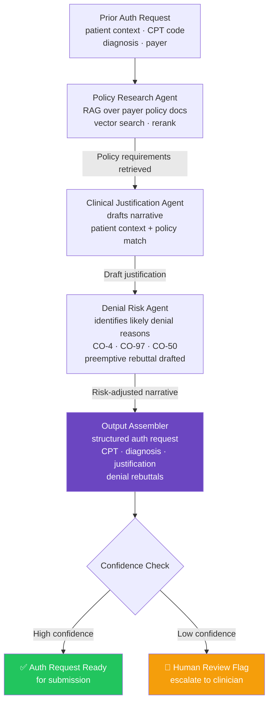

# Prior Authorization Research Agent

> **CrewAI + RAG** — Automating the most broken workflow in healthcare

[]()
[]()
[]()
[]()

## The Problem

Prior authorization kills care. Clinicians spend hours manually researching payer policies, submitting requests, and appealing denials — time that should be spent with patients. This agent automates that research pipeline end-to-end.

## What It Does

A multi-agent system built with CrewAI that:
- Researches payer-specific prior auth requirements using RAG over policy documents
- Drafts clinical justification narratives based on patient context
- Identifies likely denial reasons and preemptively addresses them
- Returns a structured authorization request ready for submission



## Tech Stack

| Layer | Technology |
|---|---|
| Agent Orchestration | CrewAI |
| Retrieval | RAG (LangChain + vector store) |
| LLM | OpenAI GPT-4 |
| Language | Python 3.11+ |

## Getting Started

```bash
git clone https://github.com/jsfaulkner86/prior-auth-research-agent
cd prior-auth-research-agent
python -m venv venv
source venv/bin/activate  # Windows: venv\Scripts\activate
pip install -r requirements.txt
cp .env.example .env  # Add your API keys
python main.py
```

## Environment Variables

Create a `.env` file (never commit this):
```
OPENAI_API_KEY=your_key_here
```

## Background

Built by [John Faulkner](https://linkedin.com/in/johnathonfaulkner), Agentic AI Architect and founder of [The Faulkner Group](https://thefaulknergroupadvisors.com). This project draws directly from 14 years of Epic EHR implementation experience across 12 enterprise health systems.

## What's Next
- Payer-specific policy document ingestion pipeline
- Appeals agent for denied authorizations
- Epic FHIR integration for real patient context

---
*Part of a portfolio of healthcare agentic AI systems. See all projects at [github.com/jsfaulkner86](https://github.com/jsfaulkner86)*
