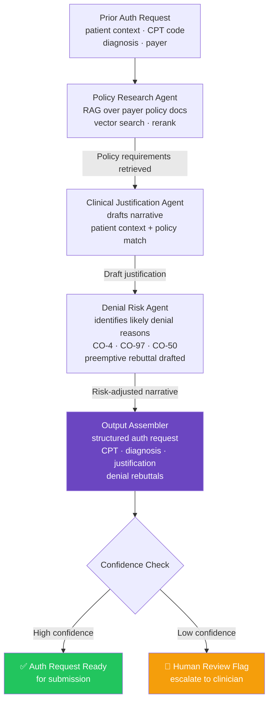

# Prior Authorization Research Agent

> **CrewAI + RAG** — Automating the most broken workflow in healthcare

[]()
[]()
[]()
[]()

## The Problem

Prior authorization kills care. Clinicians spend hours manually researching payer policies, submitting requests, and appealing denials — time that should be spent with patients. This agent automates that research pipeline end-to-end.

## What It Does

A multi-agent system built with CrewAI that:
- Researches payer-specific prior auth requirements using RAG over policy documents
- Drafts clinical justification narratives based on patient context
- Identifies likely denial reasons and preemptively addresses them
- Returns a structured authorization request ready for submission



## Tech Stack

| Layer | Technology |
|---|---|
| Agent Orchestration | CrewAI |
| Retrieval | RAG (LangChain + vector store) |
| LLM | OpenAI GPT-4 |
| Language | Python 3.11+ |

## Prior Auth Workflow Context

Prior authorization sits at the intersection of clinical documentation, payer policy, and administrative process. This agent automates the research and justification layer of that workflow — the part that consumes the most clinician time with the least clinical value.

### The X12 278 Transaction Lifecycle

Prior auth in production health systems follows the X12 278 EDI transaction standard. This agent addresses Steps 3–5 of that lifecycle:

| Step | Transaction | Description | Automated by Agent |
|---|---|---|---|
| 1 | X12 270 | Eligibility inquiry | ❌ Upstream |
| 2 | X12 271 | Eligibility response | ❌ Upstream |
| 3 | X12 278 Request | Auth request submission | 🔜 Roadmap |
| 4 | X12 278 Response | Payer approval/denial | 🔜 Roadmap |
| 5 | Policy Research | Medical necessity criteria lookup | ✅ Policy Retriever Agent |
| 6 | Clinical Justification | Narrative drafting against criteria | ✅ Criteria Matcher Agent |
| 7 | Decision Summary | Approve / Deny / Pend rationale | ✅ Decision Summarizer Agent |
| 8 | Peer-to-Peer | Clinical escalation for denials | 🔜 Roadmap |
| 9 | Appeal | Formal denial appeal submission | 🔜 Roadmap |

### Common Denial Reason Codes Addressed

The Decision Summarizer Agent is designed to preemptively address the most common payer denial reasons before submission:

| Denial Code | Meaning | Agent Response |
|---|---|---|
| `CO-4` | Service not covered / not authorized | Policy gaps flagged by Criteria Matcher |
| `CO-50` | Non-covered service — not medically necessary | Clinical justification narrative built against necessity criteria |
| `CO-97` | Payment adjusted — service/procedure not paid separately | CPT bundling conflicts flagged |
| `CO-167` | Diagnosis not covered | ICD-10 alignment check in criteria match |
| `PR-204` | Service not covered by plan | Coverage verification flag |

### Three-Agent Crew Architecture

```
Policy Retriever Agent          Criteria Matcher Agent       Decision Summarizer Agent
──────────────────────         ───────────────────────      ─────────────────────────
Input: CPT code + payer   →    Input: clinical notes    →   Input: criteria match
                                      + policy criteria             results
Output: medical necessity      Output: met / not met        Output: Approve / Deny /
        criteria list                  checklist + gaps             Pend + rationale
```

> **Process:** `Sequential` — each agent's output is the next agent's input. The crew runs end-to-end in a single `kickoff()` call.

## Getting Started

```bash
git clone https://github.com/jsfaulkner86/prior-auth-research-agent
cd prior-auth-research-agent
python -m venv venv
source venv/bin/activate  # Windows: venv\Scripts\activate
pip install -r requirements.txt
cp .env.example .env  # Add your API keys
python main.py
```

## Environment Variables

Create a `.env` file (never commit this):
```
OPENAI_API_KEY=your_key_here
```

## Background

Built by [John Faulkner](https://linkedin.com/in/johnathonfaulkner), Agentic AI Architect and founder of [The Faulkner Group](https://thefaulknergroupadvisors.com). This project draws directly from 14 years of Epic EHR implementation experience across 12 enterprise health systems.

## What's Next
- Payer-specific policy document ingestion pipeline
- Appeals agent for denied authorizations
- Epic FHIR integration for real patient context

---
*Part of a portfolio of healthcare agentic AI systems. See all projects at [github.com/jsfaulkner86](https://github.com/jsfaulkner86)*
